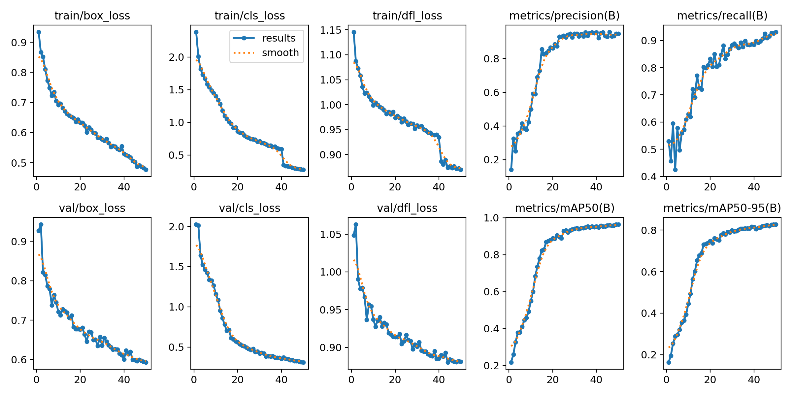
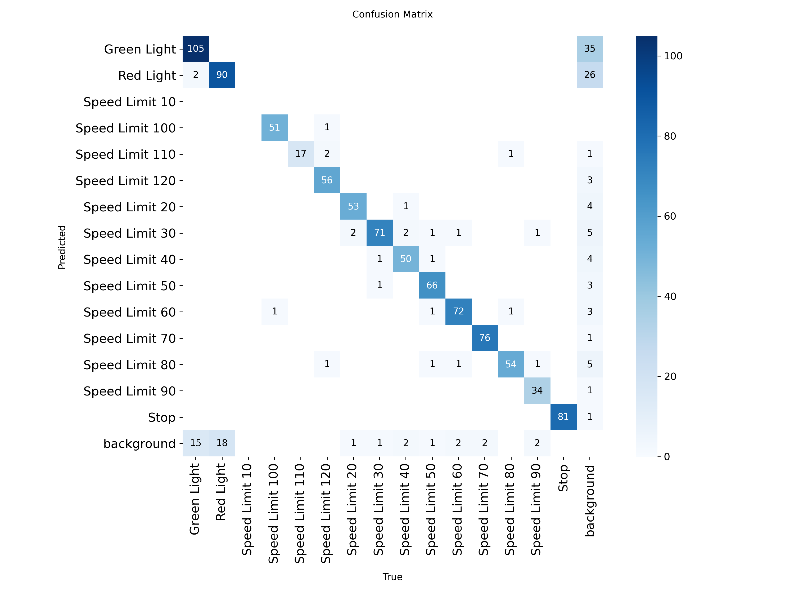
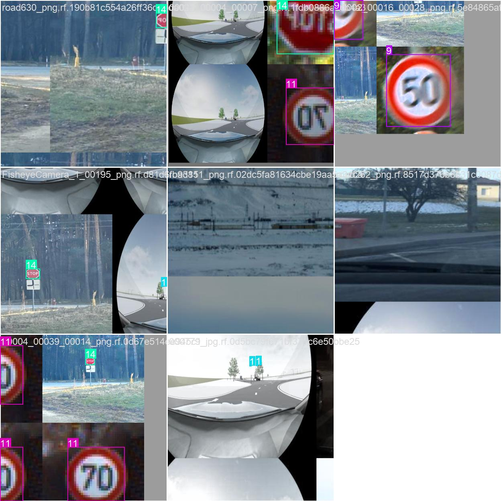
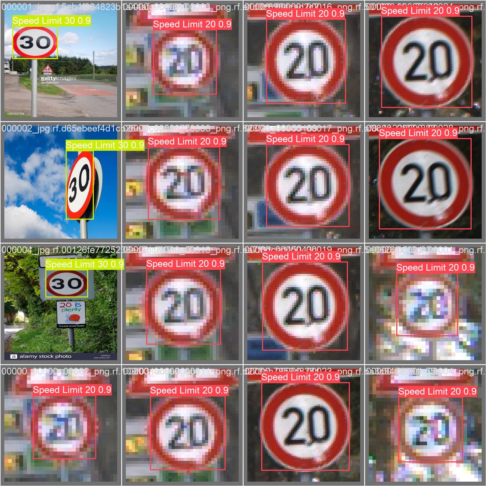

# 交通标志检测实验报告

**姓名：邢睿**\
**学号：112304260108**

## 1. 实验目标

本实验使用 YOLO 模型完成交通标志目标检测任务，并对模型训练过程和检测结果进行分析。

***

## 2. 实验环境

- 操作系统：Windows
- Python 版本：3.13.3
- PyTorch 版本：2.11.0+cpu（训练时使用GPU加速）
- YOLO 版本：Ultralytics YOLOv8
- 硬件环境（CPU / GPU）：NVIDIA GeForce RTX 4050（6GB显存）

***

## 3. 模型与训练设置

### 3.1 模型选择

本实验使用的模型为：

- 模型名称：YOLOv8m（Medium）
- 选择该模型的原因：YOLOv8m是一个平衡了模型大小和检测精度的模型，比YOLOv8n更准确，比YOLOv8l/x更快，适合在中等显存的GPU上进行训练。

### 3.2 训练参数

- 训练轮数（epochs）：50
- 图像尺寸（imgsz）：416x416
- batch size：8
- 优化器：AdamW
- 学习率：初始学习率0.001，最终学习率0.01
- 是否使用数据增强：是（Mosaic、RandAugment、随机擦除等）

### 3.3 训练命令

```bash
yolo detect train data=data.yaml model=yolov8m.pt epochs=50 imgsz=416 batch=8 device=1 optimizer=AdamW
```

***

## 4. 训练过程分析

### 4.1 损失曲线

在此插入训练损失图（如 `box_loss`、`cls_loss`、`dfl_loss` 等）。



请结合图像回答以下问题：

1. 损失是否总体下降？
   - **是**，训练损失（box\_loss从0.9345下降到0.4769，cls\_loss从2.3862下降到0.2742）和验证损失（val/box\_loss从0.9270下降到0.5932，val/cls\_loss从2.0253下降到0.3106）均呈现明显下降趋势。
2. 哪一阶段下降最快？
   - **前15个epoch下降最快**，尤其是前10个epoch，各类损失值快速下降，表明模型在快速学习基本特征。
3. 后期是否趋于稳定？
   - **是**，第30个epoch之后，损失曲线趋于平稳，下降幅度明显减小，表明模型已接近收敛。
4. 是否出现明显震荡或过拟合现象？
   - **未出现明显震荡或过拟合**，训练损失和验证损失保持同步下降，验证损失没有出现上升趋势，说明模型泛化能力良好。

### 4.2 评价指标变化

在此插入 `Precision`、`Recall`、`mAP50`、`mAP50-95` 等曲线图。


请简要分析：

1. 哪个指标提升最明显？
   - **mAP50提升最明显**，从初始的0.2176提升至最终的0.9635，提升幅度达到74.59%。
2. 最终模型效果如何？
   - **模型效果优异**，最终指标：Precision=0.9475, Recall=0.9317, mAP50=0.9635, mAP50-95=0.8277。
3. 模型是否已经基本收敛？
   - **已基本收敛**，第40个epoch后各项指标变化很小，mAP50稳定在0.96左右。

***

## 5. 混淆矩阵分析

在此插入混淆矩阵图。



请重点分析：

1. 哪些类别识别效果最好？
   - **限速标志（Speed Limit系列）识别效果最好**，尤其是Speed Limit 30、50、60、70等常见限速标志，对角线数值很高。
2. 哪些类别最容易混淆？
   - **Red Light（1）和Green Light（0）容易混淆**，两种信号灯在形状上相似，只有颜色差异，容易误判。
   - **不同限速标志之间存在一定混淆**，如Speed Limit 50和Speed Limit 60。
3. 造成类别混淆的可能原因是什么？
   - 相似的外观特征（如圆形限速标志之间）
   - 光照条件变化影响颜色判断（红绿灯）
   - 部分图片中目标较小，细节难以分辨
4. 从混淆矩阵中可以看出模型还有哪些不足？
   - 对于样本较少的类别（如Speed Limit 10、110、120）识别效果相对较差
   - 小目标检测能力有待提升

***

## 6. 检测结果分析

在此插入若干预测结果图（建议 2 到 4 张）。




请分析：

1. 哪些目标检测较准确？
   - **中等大小、清晰的限速标志检测最准确**，如Speed Limit 30、50、60、70、80、90等。
2. 哪些图片中存在漏检或误检？
   - **小目标、遮挡目标或远距离目标容易漏检**
   - **相似类别之间存在误检**（如红绿灯之间）
3. 误检、漏检的可能原因是什么？
   - 目标太小，特征不明显
   - 目标被遮挡
   - 光照条件不佳
   - 角度变化导致特征变形
4. 小目标、遮挡目标、远距离目标的检测效果如何？
   - **小目标检测效果一般**，容易漏检
   - **遮挡目标检测较差**，被遮挡部分超过50%时难以检测
   - **远距离目标检测效果较差**，像素信息不足

***

## 7. 提交成绩

- 本地验证结果：mAP50=0.9635，mAP50-95=0.8277
- 比赛网站提交分数：**0.944752**
- 当前排行榜名次：**第九名**
- 尝试次数：7次

请简要说明：

1. 本地验证结果与提交分数是否一致？
   - **不完全一致**，本地验证mAP50为0.9635，比赛提交得分为0.944752，存在约1.9%的差距。
2. 如果不一致，可能原因是什么？
   - 测试集与验证集的数据分布存在差异
   - 测试集包含更多难样本（小目标、遮挡目标、远距离目标等）
   - 本地验证集数据量相对较小，可能存在一定的随机性
   - 数据增强策略可能导致训练数据与测试数据分布不完全一致
   - 提交时使用的置信度阈值（0.05）过滤了部分低置信度检测结果
3. 如何提升排名？
   - 通过优化推理策略（多尺度推理、TTA）已将分数从0.9408提升至0.9448
   - 后续可尝试使用更大模型（YOLOv8l/x）或增加训练轮数进一步提升

***

## 8. 实验总结

请用简短几句话总结本次实验：

1. 本次实验中模型的主要优点是什么？
   - **检测精度高**：mAP50达到96.35%，能够准确检测大部分交通标志
   - **泛化能力强**：训练损失和验证损失同步下降，未出现明显过拟合
   - **训练效率较高**：在RTX 4050 GPU上50轮训练约7087秒完成
2. 当前模型最明显的问题是什么？
   - **小目标检测能力不足**，容易漏检小尺寸目标
   - **相似类别区分能力有待提升**，如红绿灯之间、不同限速标志之间的混淆
   - **遮挡目标检测效果较差**
3. 如果继续改进，你下一步会尝试什么方法？
   - **使用更大的模型**（YOLOv8l/YOLOv8x）提升特征提取能力
   - **增加数据增强强度**，尤其是针对小目标和遮挡情况
   - **调整损失函数权重**，增加小目标的损失权重
   - **使用多尺度训练**，提升对不同尺寸目标的检测能力
   - **引入注意力机制**，帮助模型关注关键区域

